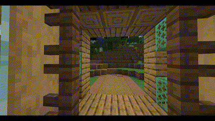
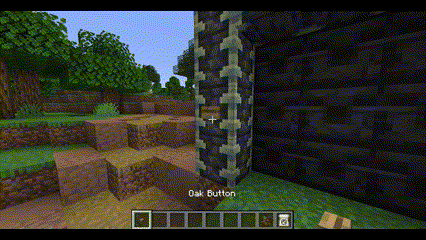

<h1>
    
</h1>

Easily build moving, functional structures such as elevators and sliding doors in Minecraft!

Requires PaperMC, Java Edition only.

\

## Features
- Smoothly animated elevators and sliding doors
- No resource packs or mods necessary!
- Elevators can lift several players and mobs
- Elevators support up to 2 auto-detected floors
- Elevators can be started by simply walking inside them
- Elevators can be called by any nearby buttons, levers, etc
- Doors can be opened/closed by any nearby buttons, levers, etc
- Two adjacent doors become double doors that move simultaneously
- Doors and elevators near each other can be auto-connected
- Easily setup doors and elevators using a familiar selection tool system

## Get Started
1. Download `ElvenideStructures.jar` into your `plugins` folder
2. Start your server
3. Use the `/estructures` command to create and manage your structures